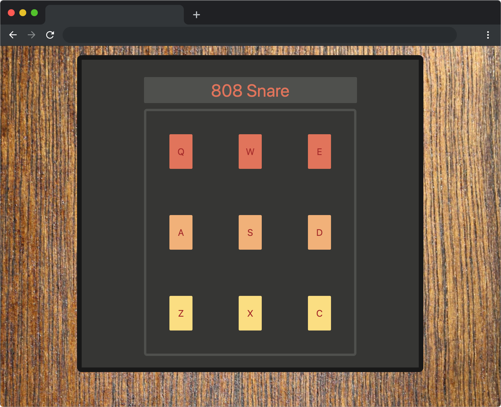

# Bing, Bang, Crash

A simple drum machine. User can click or press a keyboard key to activate an audio clip. A display is updated with the last sound played. Built using React with each drum a React element.

[Live Codepen](https://codepen.io/VanVlack/pen/Vwpmzxy?editors=0110)

## Installation and Usage

- `git pull` this repository/folder.
- No server included, please use one to prevent any cross origin problems.
- Recommended servers: `html-server`(node) or `SimpleHTTPServer`(python)

## Meta

Drew VanVlack – [@avanvlack](https://twitter.com/avanvlack) – A.Vanvlack@Gmail.com
Distributed under the MIT license. See `LICENSE` for more information.

[https://github.com/vanvlack](https://github.com/vanvlack/)
